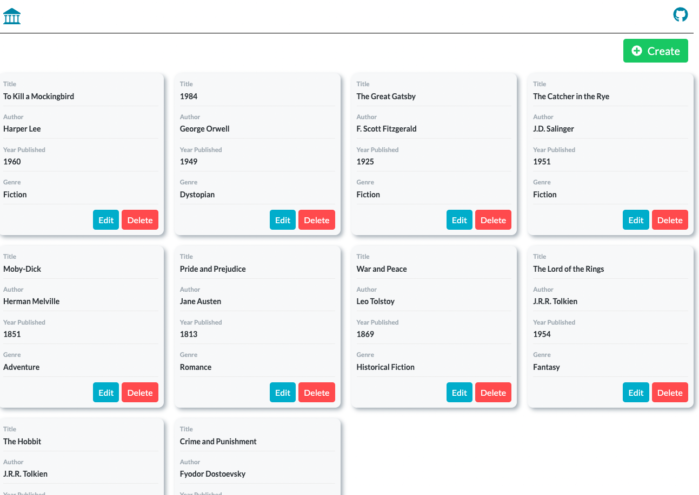

# Library

A Full Stack application that manages a library of books.

Click link below to see live demo (ctrl+click to view in different tab):

[Live](https://boiling-garden-49722-3e04e2933345.herokuapp.com/)



## Table of Contents

- [Library](#library)
  - [Table of Contents](#table-of-contents)
  - [Technologies / Libraries used](#technologies--libraries-used)
  - [Architecture](#architecture)
  - [Getting Started](#getting-started)
    - [Prerequisites](#prerequisites)
    - [Installation](#installation)

## Technologies / Libraries used

- Languages: HTML, CSS, SASS, JavaScript

- Frontend

  - React.js
  - Create React App
  - libraries:
    - react-router-dom: used for client-side routing
    - sass: used for styling
    - zustand: used for state management
    - axios: used for API requests
    - http-proxy-middleware: used to proxy requests from frontend to backend in development
    - react-icons: icons package

- Backend

  - Node.js
  - Express.js
  - testing:
    - jest: used for testing
    - supertest: used to make API requests in testing
    - REST Client: a vscode extension to test API requests inside IDE
  - libraries:
    - uuid: used to generate random ids for database
    - cors: used to enable CORS options
    - concurrently: used to run npm scripts concurrently

- Deployment:
  - Heroku
  - Git, GitHub

## Architecture

- Frontend

  - A state management library (Zustand) was used to manage the state of the books and the functions that alters the state of books
  - Separate page for each of the following:
    - List all books
    - Create a new book
    - Edit a book
  - SASS was used for the overall styling and to management the css of the project.
  - Global styles folder to manage widely used css variables and styles
  - Validation of inputs from Frontend Forms

- Backend

  - Global error handler used to respond with a consistent error structure
  - Catch error in each of the following routes and pass the error to the error handler,
    - GET /books - Retrieves all books.
    - GET /books/:id - Retrieve a single book.
    - POST /books - Adds a new book.
    - PUT /books/:id - Updates an existing book.
    - DELETE /books/:id - Deletes a book.
  - Validation of inputs from Backend route handlers

- Deployment
  - In production, Heroku builds the react application and serves it from the node backend.

## Getting Started

Follow these steps to set up and run Library on your local machine.

### Prerequisites

- Node.js: Ensure you have Node.js installed on your system. You can download it from [nodejs.org](https://nodejs.org/).

### Installation

1.  Clone the library repository to your local machine:

    ```bash
    git clone https://github.com/MichaelSukkiSong/library.git

    ```

2.  Navigate to the root project directory:

    ```bash
    cd library

    ```

3.  In the root folder install the backend dependencies using npm:

    ```bash
    npm install

    ```

4.  Navigate to the client directory from the root folder:

    ```bash
    cd client

    ```

5.  Install the frontend dependencies using npm:

    ```bash
    npm install

    ```

6.  Navigate back to the root directory:

    ```bash
    cd..

    ```

7.  Start the library application from root directory:

    ```bash
    npm run dev
    ```

- This will boot up both the Frontend and Backend code of the project in development mode.

- The Frontend application should now be running locally on http://localhost:3000 and the Backend server at http://localhost:5000.

- Navigate to http://localhost:3000 to see the application
